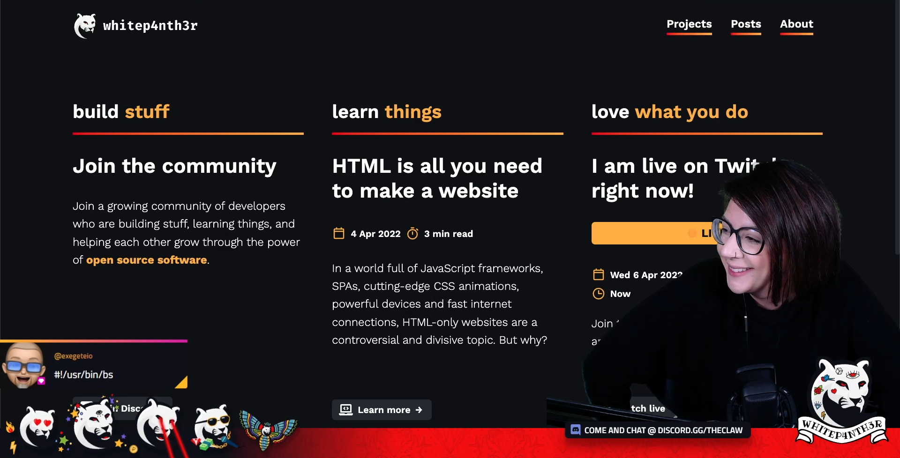

# I write code for your entertainment

I'm a software engineer, writer, and live streamer. I help developers build 🔥 cool stuff 🔥 with blog posts, tutorial videos, live coding and open source projects. I work at Netlify.

## ⚡️ Latest articles on [my blog](https://whitep4nth3r.com)

<!-- BLOG-POST-LIST:START -->
- [Single-page applications, multi-page applications, the history of Twitter tech, and a failed project](https://whitep4nth3r.com/blog/twitter-tech-history-spa/)
- [Personalize your static site based on a previous site referral](https://ntl.fyi/3SBU2DY)
- [I changed my mind about writing new JavaScript frameworks](https://whitep4nth3r.com/blog/write-a-new-javascript-framework/)
- [Rewrite your git history in 4 friendly commands](https://whitep4nth3r.com/blog/rewrite-git-history/)
- [What&#39;s the difference between : and :: in CSS?](https://whitep4nth3r.com/blog/pseudo-classes-and-pseudo-elements/)
<!-- BLOG-POST-LIST:END -->

## ⚡️ Keep up to date

- [Website](https://whitep4nth3r.com/)
- [Twitter](https://twitter.com/whitep4nth3r)
- [Twitch](https://twitch.tv/whitep4nth3r)
- [YouTube](https://www.youtube.com/c/whitep4nth3r/videos)
