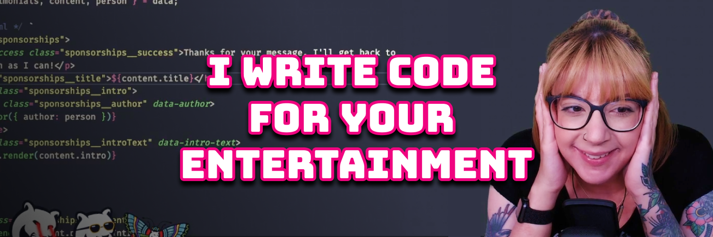

# I write code for your entertainment

I'm a live streamer, software engineer, and developer educator. I help developers build cool stuff with blog posts, tutorial videos, live coding and open source projects.

## [Things I use for coding and streaming](https://whitep4nth3r.com/uses/)

## ⚡️ Latest articles on [my blog](https://whitep4nth3r.com)

<!-- BLOG-POST-LIST:START -->
- [5 reasons you should hire me as your next developer experience engineer](https://whitep4nth3r.com/blog/hire-me/)
- [How I deploy my website using my Apple Watch](https://whitep4nth3r.com/blog/deploy-website-using-apple-watch/)
- [The best light/dark mode theme toggle in JavaScript](https://whitep4nth3r.com/blog/best-light-dark-mode-theme-toggle-javascript/)
- [A/B test CMS authored content with Netlify Edge Functions](https://www.netlify.com/blog/a-b-test-cms-authored-content-netlify-edge-functions/)
- [How to split traffic and A/B test different page layouts on the same URL](https://www.netlify.com/blog/how-to-split-traffic-a-b-test-page-layouts-same-url/)
<!-- BLOG-POST-LIST:END -->

## ⚡️ Keep up to date

- [Website](https://whitep4nth3r.com/)
- [Twitch](https://twitch.tv/whitep4nth3r)
- [Twitter](https://twitter.com/whitep4nth3r)
- [YouTube](https://www.youtube.com/c/whitep4nth3r/videos)
